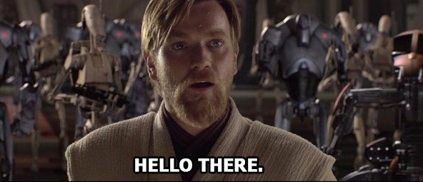
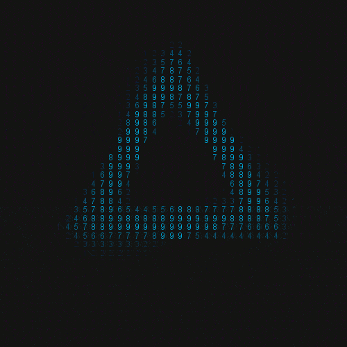

 

<b> Languages and Tools:</b>

    
    
    
    
    
    
    

<picture>
  <source media="(prefers-color-scheme: dark)" srcset="https://raw.githubusercontent.com/jakob30061/jakob30061/output/github-contribution-grid-snake-dark.svg">
  <source media="(prefers-color-scheme: light)" srcset="https://raw.githubusercontent.com/jakob30061/jakob30061/output/github-contribution-grid-snake.svg">
  
</picture>

<h2 align="center"> Statistics </h2>
<a href="https://github.com/jakob30061?tab=repositories">
  

    
    
  

</a>

  

<!-- ---------------------------------------------- -->
<link rel="stylesheet" type="text/css" href="./style.css">
